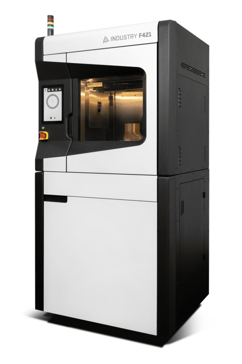
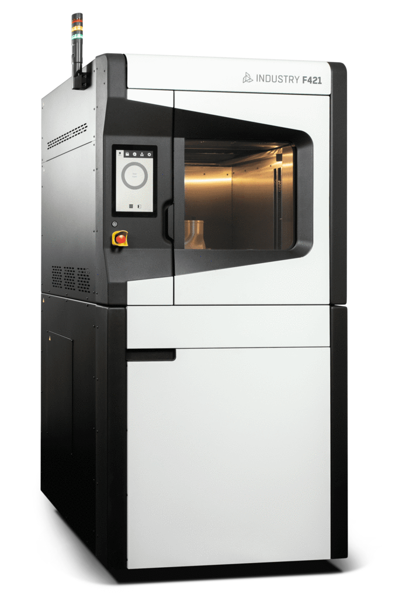


\newpage

# Beschreibung des Unternehmens
Die Airbus DS Airborne Solutions GmbH (ADAS) ist ein mit Hauptsitz in Bremen ansässiges Tochterunternehmen der Airbus Defence and Space (DS). Obwohl die ADAS zur Airbus Group gehört, agiert sie als eigenständiges Unternehmen. Die historischen Wurzeln reichen bis zur Gründung als Focke-Wulf im Jahr 1924 zurück. Nach mehreren Umstrukturierungen und Firmenwechseln, unter anderem als Teil der Atlas Elektronik GmbH, der Rheinmetall Defence Electronics GmbH und der Cassidian Airborne Solutions GmbH, wurde das Unternehmen im Jahr 2015 final von Airbus übernommen. Neben dem Standort in Bremen gibt es weltweit noch kleinere Unterstandorte unter anderem auf Malta, Kreta, in Israel und auch Jagel in Deutschland. Mit rund 300 Mitarbeitenden (Stand 2025) hat sich die ADAS gut in der Industrie etabliert. Im Gegensatz zur Muttergesellschaft, die am Bremer Flughafen ansässig ist, befindet sich der Standort der ADAS in der Bremer Neustadt.

](pics/site.jpg){#fig-site width="100%"}

Die Kernkompetenzen der ADAS umfassen die Entwicklung, Herstellung und Instandhaltung von unbemannten Drohnensystemen sowie von Frachtladesystemen (Cargo Loading Systems, CLS) für sämtliche zivile und militärische Airbus-Flugzeuge.

Aufgrund dieses breiten Aufgabenspektrums ist das Unternehmen in verschiedene spezialisierte Fachabteilungen untergliedert. Das Fundament bildet der Bereich Forschung und Entwicklung (FuE) bzw. das Engineering: Hier werden Konstruktionen geplant sowie spezifische Soft- und Hardwarelösungen entwickelt. FuE Bildet den Grundstein auf denen die anderen Abteilungen bei einem neune Produkt aufbauen.

Im Anschluss an die Entwicklungsphase erfolgt die Fertigung der Produkte in enger Abstimmung mit der Abteilung für Produktion und Instandhaltung (Production and Maintanace, P&M). Neben der Umsetzung von Neuaufträgen übernimmt dieser Bereich auch die Bearbeitung von Garantiefällen sowie die Modernisierung und Wartung bestehender Hardware. Um höchste Qualitätsstandards für die gefertigten Produkte zu gewährleisten, verfügt die ADAS über spezialisierte Testlabore und Prüfstände, die strikt nach den geforderten DIN- und ISO-Normen ausgerichtet sind und somit gut die geforderten Luftfahrtnormen abbilden können (z.B. DEMAR Part 21G/ 145). Um eine gute Erreichbarkeit von Materialien zu gewährleisten ist in der nähe noch ein Warehouse eingerichtet.

Zur Einhaltung der genannten Normen wird die interne Abteilung des Qualitätsmanagement zur Rate gezogen. Zusätzlich benötigte Abteilungen sind eine Sicherheitsabteilung zur Überwachung der Technischen und realen Sicherheit, die IT für interne technische Umsetzungen und die Personalabteilung (HR).

# Vorstellung der Abteilung und des Arbeitsbereichs
Wie im Kapitel zuvor beschrieben gibt es bei der ADAS mehrere Abteilungen. Dieses Praktikum findet in der Abteilung Produktion und Instandhaltung (P&M) statt und wird sich somit haupsächlich auf diesen Bereich beziehen. Die Hauptaufgaben der P&M bestaht darin neue Bauteile Vorschritftsgemäß zu fertigen oder bestehende zu reparieren bzw. zu ersetzen. Hierzu ist die Abteilung im rechten der beiden in @fig-site zu sehenden Gebäude lokalisiert. Dieses Gebäude beinhaltet Büro Räume, Laborplätze, Prüfstände, Konstruktionsplätze und Lagerkapazitäten. Außerdem wird eng mit der Entwicklung und dem Warehouse zusammengearbeitet. Es kommen täglich neue Aufträge zur Instandhaltung, Reparatur oder auch Verschrottung rein welche bearebeitet werden. Neben dem Tagesgeschäft gibt es außerdem Aufträge von der Entwicklung zur Umsetzung von Prototypen und auch kompletter Fertigung. Hier stellt ein großer Teil auch der 3D-Druck dar, welcher bei Prototypen und auch bei fertigen Lösungen für spezielle Aufträge genutzt wird. In der Konstruktionswerkstatt werden diese speziellen Lösungen geplant und gefertigt. 

\newpage
# Aufgabenstellung
In dem Praktikum soll eine Machbarkeitsstudie zur Weiterentwicklung eines Industriedruckers erstellt werden. Hierbei handelt es sich um einen Industry F421 der Firma 3DGence. 

::: {#fig-3dgence layout-ncol=2}
{#fig-ansicht1}

{#fig-ansicht2}

3DGence Industry F421 [@3dgence_f421]
:::

Der aktuelle Drucker weißt erhebliche softwareseitige Probleme auf, somit entstehen sämtliche Fehlermeldungen beim durchführen eines Drucks. Das Ziel dieses Praktukums ist es diesen Drucker zu analysieren und zu prüfen ob es möglich sei, durch Software- oder sogar Hardware-, Anpassung eine Verbesserung der momentanen Lage zu erreichen. Dazu wird sich als erstes mit allgemeinen 3D-Druck Technologien auseinander gesetzt und im Anschluss erste Software und Hardware seitige Tests durchgeführt. Somit wird mit Hilfe eines Raspberry Pi 5 zuerst versucht einzelne Bauteile eines 3D-Druckers, z.B. die Step-Motoren, anzusteuern. Nach erfolgreichen ansteuern der Refernzbauteile wird auf das original System gewechselt. Somit kann eine fundierte Analyse der Machbarkeit erstellt werden und in Nachfolgeprojekten die einzelnen Komponenten zusammengesetzt und der Drucker fertiggestellt werden.

# Bisherige Ergebnisse

\newpage
# Literaturverzeichnis
\markboth{Literaturverzeichnis}{Literaturverzeichnis}

::: {#refs}
:::
